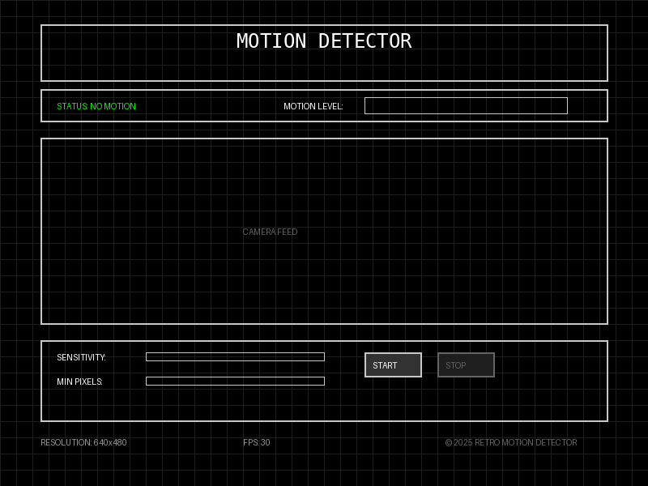

# Retro Motion Detector

A web-based motion detection application that uses your webcam to detect and alert you of movement in real-time. The application features a retro-inspired black and white user interface with customizable sensitivity settings.

## Quick Start

1. Extract all files from the ZIP archive
2. Open `index.html` in your web browser
3. Click "START" and allow camera access when prompted
4. Adjust sensitivity sliders as needed

## Features

- **Real-time Motion Detection**: Analyzes webcam feed to detect movement
- **Adjustable Sensitivity**: Customize detection thresholds to your needs
- **Visual Indicators**: Clear status display and motion level meter
- **Sound Alerts**: Optional audio notification when motion is detected
- **Retro UI Design**: Clean, minimalist black and white interface
- **Performance Metrics**: Real-time FPS and resolution display
- **Responsive Design**: Works on desktop and mobile devices
- **No Server Required**: Runs entirely in the browser with no data transmission

## Installation

1. Clone or download this repository
2. No additional dependencies or installation required
3. Open `index.html` in a modern web browser
4. Grant camera permissions when prompted

## Camera Permissions

### Chrome
1. When prompted, click "Allow" in the permission dialog
2. If denied accidentally, click the camera icon in the address bar and select "Allow"
3. Alternatively, go to Settings > Privacy and Security > Site Settings > Camera

### Firefox
1. When prompted, click "Allow" in the permission dialog
2. If denied, click the camera icon in the address bar and select "Allow"
3. Or navigate to Preferences > Privacy & Security > Permissions > Camera

### Safari
1. When prompted, click "Allow" in the permission dialog
2. If denied, go to Safari > Preferences > Websites > Camera
3. Find the website and change the permission to "Allow"

### Edge
1. When prompted, click "Allow" in the permission dialog
2. If denied, click the lock icon in the address bar and enable camera access
3. Or go to Settings > Site permissions > Camera

## Usage Guide

### Getting Started

1. Open the application in your web browser
2. Click the "START" button to begin motion detection
3. Allow camera access when prompted by your browser
4. The application will immediately begin monitoring for motion

### Adjusting Settings

- **Sensitivity**: Controls how sensitive the detector is to small movements
  - Lower values: Only detect significant movement
  - Higher values: Detect subtle movements
- **Min Pixels**: Sets the minimum number of changed pixels required to trigger detection
  - Lower values: Detect smaller objects moving
  - Higher values: Only detect larger movements

### Understanding the Interface

- **Status Indicator**: 
  - "NO MOTION" (green): No movement detected
  - "MOTION DETECTED" (red): Movement detected
- **Motion Level Meter**: Visual representation of the amount of motion detected
- **Sound Toggle**: Enable/disable the audio alert when motion is detected

## Troubleshooting

### Camera Not Working
- **Problem**: "CAMERA ACCESS DENIED" message appears
- **Solution**: Check browser permissions and allow camera access as described in the Camera Permissions section

### Performance Issues
- **Problem**: Low FPS or laggy detection
- **Solution**: Lower the resolution in your browser's camera settings or reduce the sensitivity value

### No Sound
- **Problem**: No sound alert when motion is detected
- **Solution**: 
  1. Ensure the sound toggle is enabled (checkbox is checked)
  2. Check if your browser allows audio playback
  3. Verify your system volume is not muted

### Browser Compatibility
- **Problem**: Application doesn't work in your browser
- **Solution**: Try a different modern browser like Chrome, Firefox, or Edge

### Motion Detection Too Sensitive/Not Sensitive Enough
- **Problem**: False positives or missed motion
- **Solution**: Adjust both the Sensitivity and Min Pixels sliders until you find the right balance

## Technical Implementation Details

### Motion Detection Algorithm

The application uses a pixel-comparison algorithm that:
1. Captures frames from the webcam
2. Converts frames to grayscale for processing
3. Compares consecutive frames to detect changes
4. Calculates the percentage of pixels that have changed
5. Triggers detection when changes exceed the threshold

### Key Technologies Used

- **MediaDevices API**: For webcam access
- **Canvas API**: For frame processing and analysis
- **Web Audio API**: For sound notifications
- **CSS Grid & Flexbox**: For responsive layout
- **CSS Variables**: For consistent theming

### Performance Considerations

- Frame processing is optimized to maintain high FPS
- Pixel sampling reduces CPU usage on high-resolution cameras
- Visibility API integration pauses processing when tab is inactive

## Browser Compatibility

The application is compatible with all modern browsers that support the MediaDevices API:

- Chrome (version 53+)
- Firefox (version 36+)
- Edge (version 12+)
- Safari (version 11+)
- Opera (version 40+)

Mobile browsers with camera support are also compatible.

## Project Structure

- `index.html`: Main application HTML structure
- `styles.css`: Retro-themed styling and responsive design
- `script.js`: Motion detection algorithm and application logic
- `assets/bing.mp3`: Sound notification (MP3 format)
- `assets/bing.wav`: Sound notification (WAV format for broader compatibility)

## Credits and Acknowledgments

- Fonts: VT323 and Share Tech Mono from Google Fonts
- Sound effects: Optimized for minimal latency and retro feel
- Design inspiration: Classic terminal interfaces and retro computing

## License

This project is available for personal and educational use.

---

© 2025 RETRO MOTION DETECTOR